# 1701QCA Final project journal: *Insert your name here*

<!--- As for other assessments, fill out the following journal sections with information relevant to your project. --->

<!--- Markdown reference: https://guides.github.com/features/mastering-markdown/ --->

## Related projects ##
<!--- Find about 6 related projects to the project you choose. A project might be related through  function, technology, materials, fabrication, concept, or code. Don't forget to place an image of the related project in the appropriate folder and insert the filename in the appropriate places below. Copy the markdown block of code below for each project you are showing. --->

### *Insert name of related project here* ###

<!--- Modify code to insert image of related project below --->

<!--- Fill out name and link to related project in the code below. --->
[Name of related project](https://[URL of related project])

<!--- Include information about why this project is related to yours. --->

<!--- Repeat code above for a total of 6 related projects --->

## Other research ##
<!--- Include here any other relevant research you have done. This might include identifying readings, tutorials, videos, technical documents, or other resources that have been helpful. For each particular source, add a comment or two about why it is relevant or what you have taken from it. You should include a reference or link to each of these resources. --->

### Related project 1 ###
*Name: micro:bit Smart Home (with BH1750, BME280, HC-SR501, SW-420 sensors and LCD 1602)*

*URL: https://www.youtube.com/watch?v=m64T7HHNOII*

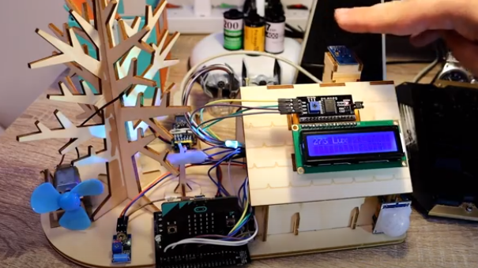

This project relates through the concept of building a smart home through a microbit. I found this project after starting mine as I didn’t have enough related projects and I found that this was really similar to the functions I’ve included for mine such as the automatic fan and light. *.

### Related project 2 ###
*Name: Smarthon Smart House Kit for micro:bit (model 2)*

*URL: https://www.youtube.com/watch?v=us7mOg1nLG8*

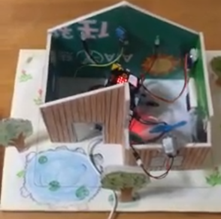

This project relates through the concept of building a smart home through a microbit. This was also found after I began and I found that the creator also has a similar function with the fan however, can be manually turned on through the microbit buttons. *.

### Related project 3 ###
*Name: micro:bit SOKIT : Making a smart house.*

*URL: https://it-it.facebook.com/thinksokit/videos/vb.1651182875206612/319983735368250/?type=2&theater*

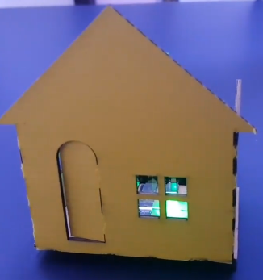

This project relates through the concept of a smart home, with the functions of turning on light and changing colour.*.

### Related project 4 ###
*Name: BBC micro:bit - Door Alarm system with smart Light*

*URL: https://www.youtube.com/watch?v=ZOLvpmQ5HOs*

This project relates through the concept, with the functions of a smart light and uses the buzzer to create a door alarm system.*.

### Related project 5 ###
*Name: Micro:bit Smart Home - light, fan and alarm system.*

*URL: https://www.hackster.io/73125/micro-bit-smart-home-light-fan-and-alarm-system-bd1e6f*

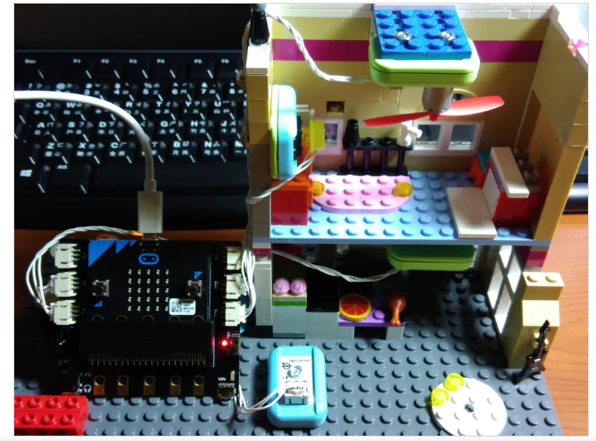

This project is related to mine because it includes an automatic light and fan.*.

### Related project 6 ###
*Microbit Smart Home Kit: Smart Home [BM]*

*URL:https://www.youtube.com/watch?v=O-ALLqKYfRo&t=83s*

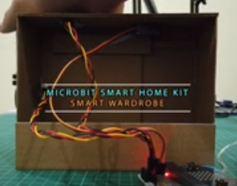

This project is related to mine because the material they have used to make this project is cardboard which is the material I have mainly used.

## Other research ##
*1. Micro:bit - Heat activated Fan*

*This was used in the previous project of the temperature gauge, and helped me in the process of making the functions of the ceiling fan.*

*2. Micro:bit Pins*

*This helped me understand more about the pins as I was having trouble with space which can be seen in the fifth design process discussion.*

### *Brief resource name/description* ###

*1. https://www.youtube.com/watch?v=iilfeimMDjM*

*2. https://makecode.microbit.org/device/pins*

## Conceptual development ##

### Design intent ###
<!--- Include your design intent here. It should be about a 10 word phrase/sentence. --->

### Design ideation ###

### Design concept 1 ###

*The first concept was based off of the game Animal Crossing. The recent release of Animal Crossing New Horizons is where the inspiration came from however, I have based it off a feature in the previous game of a train station in Animal Crossing New Leaf. Some of the functions in this concept that I was going to implement are an object that represents the train in the game would be placed on the track which the lights would flicker, the bars would go down and it would make a beeping sound just like in the game.*

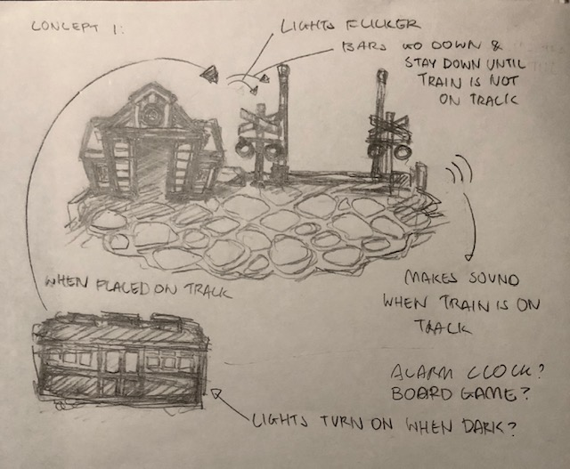

### Design concept 2 ###
*The second concept would be a flower lamp that opens up when dark which lights up in the middle and closes when it is bright.*

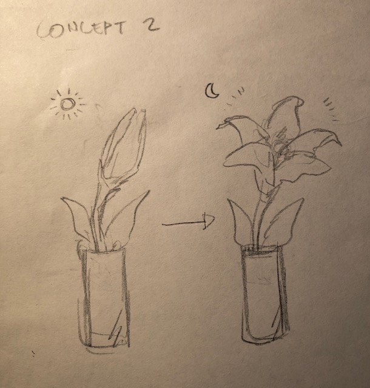

### Final design concept ###
<!--- This should be a description of your concept including its context, motivation, or other relevant information you used to decide on this concept. --->

*The third and chosen concept would be a room which the light would turn on when its dark, the fan would turn on when the temperature is high and different songs would be played with one button.*
*The main materials to be used would be cardboard for the structure of the room and furniture and paper for covering the cardboard.*

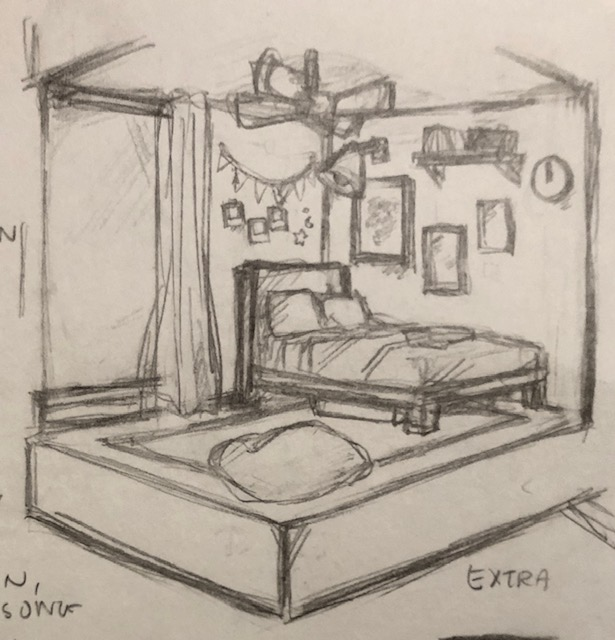

### Interaction flowchart ###
<!--- Include an interaction flowchart of the interaction process in your project. Make sure you think about all the stages of interaction step-by-step. Also make sure that you consider actions a user might take that aren't what you intend in an ideal use case. Insert an image of it below. It might just be a photo of a hand-drawn sketch, not a carefully drawn digital diagram. It just needs to be legible. --->

## Process documentation ##
<!--- In this section, include text and images (and potentially links to video) that represent the development of your project including sources you've found (URLs and written references), choices you've made, sketches you've done, iterations completed, materials you've investigated, and code samples. Use the markdown reference for help in formatting the material.

This should have quite a lot of information! It will likely include most of the process documentation from assessment 2 which can be copied and pasted here.

Use subheadings to structure this information. See https://guides.github.com/features/mastering-markdown/ for details of how to insert subheadings.

There will likely by a dozen or so images of the project under construction. The images should help explain why you've made the choices you've made as well as what you have done. --->

## Design process discussion ##
*I worked on getting the fan blade to work with the piezo element buzzer making sounds. I have used similar coding to the previous project I have done with the temperature gauge and included the coding for when the external button is pressed, sounds would be made through the buzzer with the help of experiment 6 from the Inventor’s Kit Tutorial Book.*

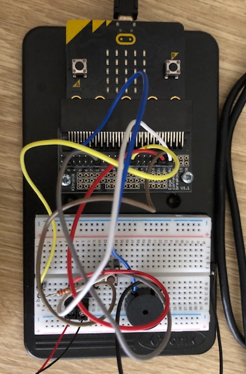

## Design process discussion ##
*The digital write pin was set to P2 instead of P4 for the fan as this was taken after testing the LED lights.*

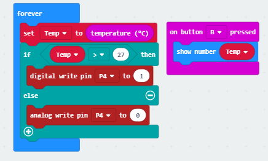

## Design process discussion ##
*Before, I had a default tune that can be found in the “play melody” block however, I played around with the tones to create a tune from a film by Ghibli Studios.*

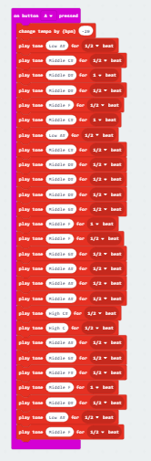

## Design process discussion ##
*I also started building the room with cardboard, paper, and the scraps of material that I had. *

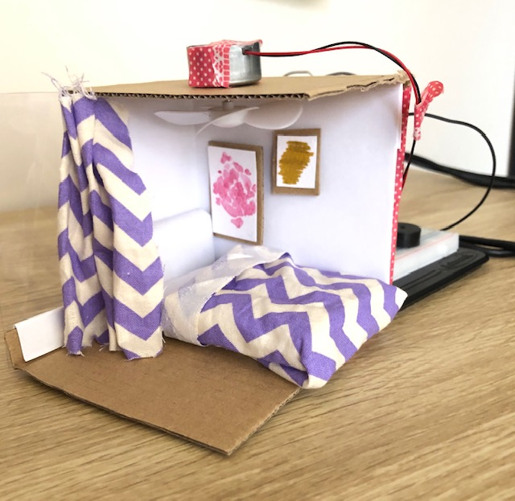

## Design process discussion ##
*Next I worked on including the automatic light. I was having some issues with space as I had no more of the large pins left. Pin 0 was connected to the buzzer, pin 1 was connected to the external button for the buzzer and pin 2 was connected to the fan. I changed the pin that was connected to the button to pin 5 as I found that the pin is a GPIO shared with button A, which opened up space for pin 1. I still needed one more pin for the LED, as I used pin 1 to place the phototransistor.*

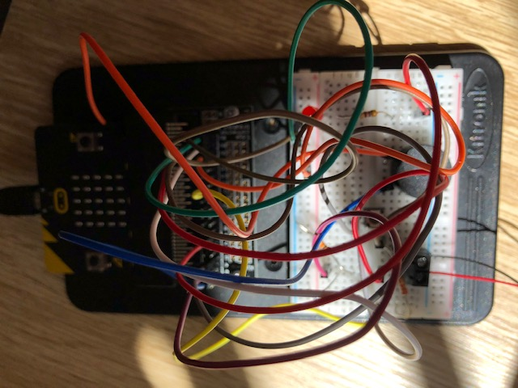
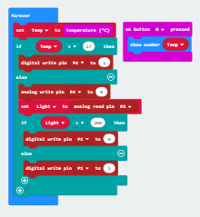

## Design process discussion ##
*I was using the microbit LED screen to show icons so I could see if the phototransistor was working. I removed the function of this as I found that some of the pins had the same functions as the large pins with the GPIO and ADC but can only be used when the LED is not on. I switched the pin for the fan with the LED so that it is in pin 2 and placed the wire connected to the fan to pin 4 as it wouldn’t work oppositely. *

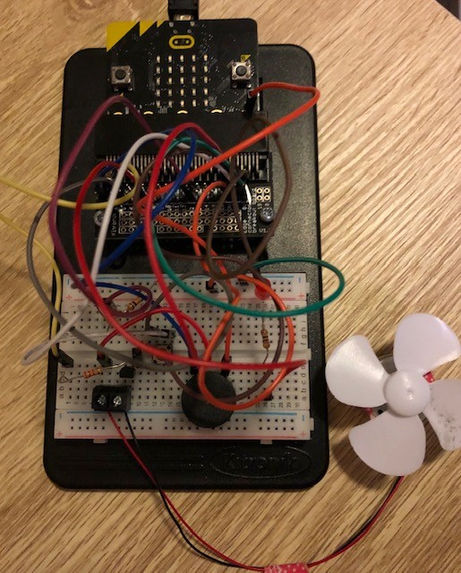

## Final code ##

<!--- Include here screenshots of the final code you used in the project if it is done with block coding. If you have used javascript, micropython, C, or other code, include it as text formatted as code using a series of three backticks ` before and after the code block. See https://guides.github.com/features/mastering-markdown/ for more information about that formatting. --->

## Design process discussion ##
<!--- Discuss your process used in this project, particularly with reference to aspects of the Double Diamond design methodology or other relevant design process. --->

## Reflection ##

<!--- Describe the parts of your project you felt were most successful and the parts that could have done with improvement, whether in terms of outcome, process, or understanding.

What techniques, approaches, skills, or information did you find useful from other sources (such as the related projects you identified earlier)?

What parts of your project do you feel are novel. This is IMPORTANT to help justify a key component of the assessment rubric.

What might be an interesting extension of this project? In what other contexts might this project be used? --->
